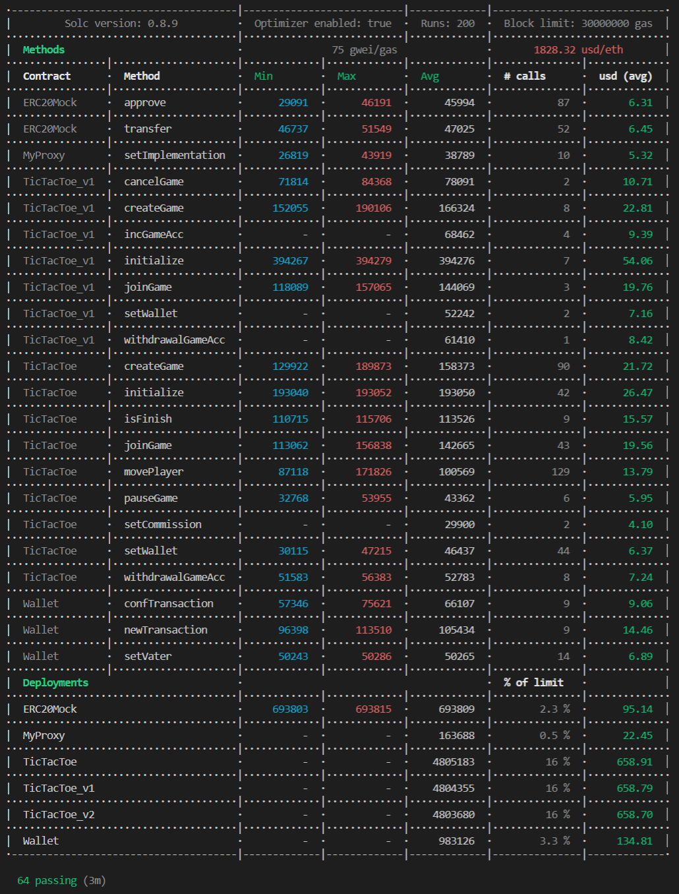

## ilink Academy. Домашняя работа #4. 

### Задача:  
Proxy смарт-контракт, интерфейсы.    
1. Подключить proxy.  
2. Изменить логику контракта.  
3. Проверить обновление контракта, используя proxy.  

### Реализация
Hardhat 2.9.1;  
Solidity 0.8.9;

### Решение  
Решение состоит из:  
- Смарт контракт "Крестики нолики v1"  
- Смарт контракт "Крестики нолики v2"  
- Смарт контракт "Крестики нолики v3"  
- Смарт контракт "Proxy"  
#### Контракт "Крестики нолики v1":  
Функционал практически не менялся с [прошлого домашнего задания](https://github.com/PushinSt/TicTacToe-hardhat-ilink-v2/).  
Изменения:
1. Добавление функции отмены игры и возврата ставки
`function cancelGame(uint256 _idGame) external`  
_idGame - Идентификатор игры (её порядковый номер в массиве games).  

2. Добавление тестовой функции для проверки обновления контракта
`function getTest() external pure returns (uint256)`  
Функция не принимает аргументов и возвращает константное значение __10__.  

#### Контракт "Крестики нолики v2":  
Ошибка при добавлении новой переменной.
Демонстрация этой ошибки представлена в пункте [Демонстрация тестирования контракта proxy](#%D0%B4%D0%B5%D0%BC%D0%BE%D0%BD%D1%81%D1%82%D1%80%D0%B0%D1%86%D0%B8%D1%8F-%D1%82%D0%B5%D1%81%D1%82%D0%B8%D1%80%D0%BE%D0%B2%D0%B0%D0%BD%D0%B8%D1%8F-%D0%BA%D0%BE%D0%BD%D1%82%D1%80%D0%B0%D0%BA%D1%82%D0%B0-proxy).  
Изменения:
1. Добавление тестовой переменной testProxy. 
Переменная testProxy добавлена в середину хранилища. Из-за этого нарушается порядок хранения переменных.   

#### Контракт "Крестики нолики v3":  
Исправление ошибок и обновление логики смарт-контракта.
Демонстрация обновления наглядно показана в пункте [Демонстрация тестирования контракта proxy](#%D0%B4%D0%B5%D0%BC%D0%BE%D0%BD%D1%81%D1%82%D1%80%D0%B0%D1%86%D0%B8%D1%8F-%D1%82%D0%B5%D1%81%D1%82%D0%B8%D1%80%D0%BE%D0%B2%D0%B0%D0%BD%D0%B8%D1%8F-%D0%BA%D0%BE%D0%BD%D1%82%D1%80%D0%B0%D0%BA%D1%82%D0%B0-proxy).  
Изменения:
1. Замена функции incGameAcc() на стандартную receive()
`receive() external payable`  
Весь эфир, который передаётся вместе с функцией конвертируется в монеты erc20 и зачисляется на счет игрока 

2. Удаление тестовой переменной testVar, которая вызывала ошибку распределения памяти.  

3. Изменение тестовой функции для проверки обновления контракта
`function getTest() external pure returns (uint256)`  
Функция не принимает аргументов и возвращает константное значение __20__.  

#### Контракт "Proxy":   
Смарт контракт состоит из:  
1. Переменная _IMPL_SLOT, которая хранит в себе уникальную ссылку на ячейку памяти, где находится адрес текущей версии смарт контракта TicTacToe;  

Реализованные методы:
1. Функции receive и fallback:  
Функция перенаправляет вызов функций смарт контракта TicTacToe

2. Установить новый адрес контракта TicTacToe:
`function setImplementation(address _implementation) external`
_implementation - Новый адрес смарт контракта  TicTacToe.  

3. Получить текущий адрес контракта TicTacToe:
`function getImplementation() external view returns (address)`

#### Задачи для cli hardhat (proxy)
Смарт контракт размещался в тестовой сети. 
Задачи практически не менялись с [прошлого домашнего задания](https://github.com/PushinSt/TicTacToe-hardhat-ilink-v2/)
1. Записать новый адрес смарт контракта:  
`npx hardhat set-imple --network $network --address $address --contract $contract --player $player `  
$network - сеть для выполнения задачи, $address - адрес Proxy контракта, $contract - новый адрес смарт контракта, $player - порядковый номер счета из mnemonic. 

2. Инициализация контракта:  
`npx hardhat init-contract --network $network --address $address --erc $erc --player $player `  
$network - сеть для выполнения задачи, $address - адрес Proxy контракта, $erc - адрес контракта ERC20, $player - порядковый номер счета из mnemonic. 

#### Тестирование
Автоматизированные тесты находятся в папке test и запускаются командой:  
`npx hardhat test`

Анализ расхода газа можно включить с помощью ключа GAS_REPORT:

#### Проверка и публикация исходного кода контракта
Команда для публикации контрактов в тестовой сети kovan:  
Для публикации первой версии контракта:   
`npx hardhat kovan --network kovan --tags TicTacToe`  
Для публикации новой версии контракта:  
`npx hardhat kovan --network kovan --tags TicTacToe-update`  

Команда для верификации контракта в сети kovan:  
`npx hardhat --network kovan etherscan-verify --solc-input --contract-name TicTacToe`  
`npx hardhat --network kovan etherscan-verify --solc-input --contract-name MyProxy`  

Адрес смарт контракта TicTacToe_v1 в тестовой сети kovan: 0xCF80249a1BC877ef6403E6359A99999Aaef45740
Адрес смарт контракта TicTacToe_v2 в тестовой сети kovan: 0xe79F696B7FCdDCC172eb4932D3103c328B5201e8
Адрес смарт контракта TicTacToe_v3 в тестовой сети kovan: 0x4C4f0C8b127fA4e4e23FDF50Cf486F54623f6C26
Адрес смарт контракта Proxy в тестовой сети kovan: 0x30A45aC01C12730AEb3226831b30500841e713Bb
Адрес смарт контракта ERC20Mock:  в тестовой сети kovan: 0xAAcb8B7D29621c00408ecF4c0A522DAEB7f84Df5
Адрес смарт контракта Wallet:  в тестовой сети kovan: 0x2362FC9f3855bf1d053e1C8FE9E4Eb9f984299e2

##### Демонстрация тестирования контракта proxy 

1. Деплой TicTacToe_v1:  
`initialize("0xAAcb8B7D29621c00408ecF4c0A522DAEB7f84Df5")` - Адрес смарт контракта erc20  
`setWallet("0x2362FC9f3855bf1d053e1C8FE9E4Eb9f984299e2");` -  Адрес смарт контракта кошелька  
`getWallet();` - answer: "0x2362FC9f3855bf1d053e1C8FE9E4Eb9f984299e2"  - Верно  
`getTest();` - answer: "10" - Верно   

2. Деплой TicTacToe_v2:  
`getWallet();` - answer: "0xAAcb8B7D29621c00408ecF4c0A522DAEB7f84Df5"  - Ошибка, теперь по адресу кошелька находится адрес erc20  
3. Деплой TicTacToe_v3:  
`getWallet();` -  answer: "0x2362FC9f3855bf1d053e1C8FE9E4Eb9f984299e2" - Верно  
`getTest();` - answer: "20" - Верно  
